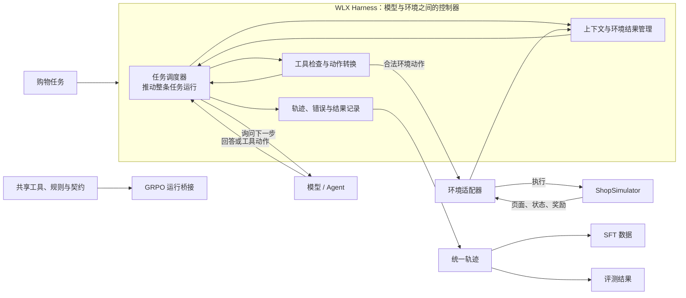

# WLX Harness 说明（重写大纲）

> 当前状态：本文档暂时只写大纲，用来先确认讲解顺序、内容边界和配图方案。大纲确认后，再按这个结构逐节补充正文。

## 这份说明写给谁

这份说明面向第一次接触 Agent、Harness、SFT 和 GRPO 的读者。

正文将遵守三个原则：

1. 先讲“为什么这样设计”，再介绍代码中的名字。
2. 第一次出现的术语立即用大白话解释，不假设读者已经了解 Agent 框架。
3. 只讲理解系统所需的关键细节；具体字段、完整参数和逐行代码放在最后的代码导航中。

## 先给出整篇说明的中心结论

可以先把 WLX Harness 理解成：

> **位于模型和购物环境之间的控制器。它推动一条购物任务向前运行，检查模型提出的动作，把合法动作交给 ShopSimulator，再把环境结果整理后交还模型，同时记录全过程。**

不过它不只是一个“消息转发器”。它还承担四类职责：

- **控制**：决定一条任务什么时候开始、继续、结束。
- **检查**：阻止不存在、不合法或当前状态不能执行的动作。
- **隔离**：避免把环境内部信息、隐藏答案或过长页面直接交给模型。
- **记录**：保存完整轨迹、错误、终止原因和奖励依据，供 SFT、GRPO 和评测使用。

### 系统位置预览图

图中出现的“任务调度器”就是代码里的 `Runner`。它不是一种新模型，也不是服务器；它只是一段负责把“一条任务从开始推动到结束”的控制程序。

---

## 第一部分：为什么需要 Harness

这一部分从问题出发，不先讲类名。

### 1.1 模型和环境为什么不能直接连接

正文将说明：

- 模型只会生成文字或工具调用建议，并不会真的操作商店。
- ShopSimulator 只接受规定格式的动作，不会理解模型随意写出的自然语言。
- 模型可能写错工具、漏参数、重复操作，或者在错误页面购买。
- 环境返回的信息不一定都应该给模型看。
- 没有统一记录，就无法判断失败来自模型、环境、网络还是训练框架。

### 1.2 如果每个阶段各写一套交互代码，会有什么问题

正文将用 SFT、GRPO 和评测举例说明：

- 三套工具定义可能慢慢变得不一样。
- 同一个环境错误可能在不同阶段被不同处理。
- SFT 学到的动作规则可能和 GRPO、评测时的规则不一致。
- 奖励、终止条件和隐藏信息容易发生泄漏或漂移。

### 1.3 Harness 要解决的问题

本节最后会把目标归纳为：

1. 给模型和环境建立稳定的沟通边界。
2. 把一次完整任务的控制流程集中到一个地方。
3. 让不同训练阶段尽量共享同一套行为规则。
4. 让每一次成功和失败都能被解释、复现和检查。

---

## 第二部分：先划清系统边界

这一部分回答“哪些事情归 Harness 管，哪些不归它管”。

### 2.1 Harness 负责什么

- 接收购物任务。
- 组织每一轮模型请求。
- 检查并转交工具动作。
- 调用和释放环境。
- 整理模型可见的环境结果。
- 控制步骤、上下文和错误边界。
- 生成统一轨迹。

### 2.2 Harness 不负责什么

- 不替模型决定应该买什么。
- 不实现 ShopSimulator 内部的商品世界。
- 不负责训练模型参数。
- 不凭空制造奖励。
- 不保证所有阶段必须使用完全相同的底层运行框架。

### 2.3 三条最重要的边界

正文将重点解释：

- **模型负责决策，Harness 负责控制。**
- **环境负责改变世界，Harness 负责安全地调用环境。**
- **训练器负责更新参数，Harness 负责提供可信的交互过程和结果。**

本节配图：系统上下文图，明确模型、Harness、ShopSimulator、训练阶段各自的位置和责任。

---

## 第三部分：一步一步设计 WLX Harness

这是整份说明的主体。每一步统一回答四个问题：

1. 当时要解决什么问题？
2. 采用了什么设计？
3. 为什么不直接使用更简单的做法？
4. 这个设计最终给后续阶段带来了什么？

### 第一步：先规定一次任务的生命周期

需要讲清楚：

- 一条购物任务从哪里开始。
- 什么叫“一轮模型回答”。
- 什么叫“一次环境动作”。
- 什么时候继续，什么时候结束。
- 无论成功还是失败，为什么最后都必须释放环境。

这里正式介绍 `Runner`：

> `Runner` 是 Harness 里的任务调度程序。它按照固定顺序反复执行“问模型、检查动作、调用环境、记录结果”，直到任务完成、达到限制或发生不能继续的错误。

本节配图：一条 Episode 的标准流程图。

### 第二步：为模块之间规定统一的“交接单”

需要讲清楚为什么不能让各模块随便传字典，以及统一数据结构解决了什么问题。

正文只介绍五个最重要的概念：

- `Task`：这次要完成的购物任务。
- `ModelRequest`：Harness 本轮准备交给模型的请求包。
- `AssistantTurn`：模型本轮给出的回答和动作建议。
- `EnvironmentResult`：环境执行动作后返回的结果。
- `Trajectory`：从任务开始到结束的完整档案。

`EnvironmentStep`、`TrajectoryStep` 等容易混淆的细节放到术语附录，不在主线中过早展开。

本节配图：核心数据在各模块之间流动的数据流图。

### 第三步：设计受控的工具入口

需要讲清楚：

- 工具说明只是告诉模型“有哪些按钮”，不等于模型已经执行按钮。
- 为什么要统一工具名称和参数格式。
- 为什么动作在进入环境前还要检查。
- 工具不存在、参数错误、当前页面不允许时分别怎样处理。

这里用大白话介绍：

- `ToolRegistry`：工具清单和动作翻译员。
- `Guard`：环境执行前的门卫。

本节配图：工具动作从“模型建议”到“环境执行”的判断流程图。

### 第四步：用适配器隔离模型和环境的具体实现

需要讲清楚：

- 为什么 Runner 不直接写死 HTTP 请求和 ShopSimulator 字段。
- 为什么模型客户端也需要一个统一接口。
- 更换模型服务或环境实现时，哪些代码不需要跟着改变。

这里介绍两个接口角色：

- 模型适配器：把统一的模型请求接到具体 Chat Completions 服务。
- 环境适配器：把统一环境操作接到具体 ShopSimulator 服务。

本节配图：端口与适配器组件图。

### 第五步：管理模型真正能看到的信息

需要把三件经常混淆的事情分开：

1. Harness 保存的完整聊天历史。
2. 本轮实际发给模型的上下文。
3. 环境原始结果与模型可见结果。

正文将说明：

- 为什么原始环境结果不能原样全部给模型。
- 单次页面裁剪和删除旧聊天历史有什么区别。
- 上下文达到总 token 上限时，停止、报错和压缩分别意味着什么。
- KV Cache 为什么是计算加速，而不是聊天记忆。

本节配图：信息可见性分层图，以及上下文达到预算时的分支流程图。

### 第六步：把全过程记录成可信轨迹

需要讲清楚为什么不能只保存最终 reward。

一条可信轨迹至少要回答：

- 模型看到了什么。
- 模型提出了什么动作。
- 动作是否被拒绝。
- 环境实际执行了什么。
- 环境返回了什么。
- 为什么结束。
- 奖励是否有效。
- 是否发生基础设施错误。

这里将 `Trajectory` 比作“一条任务的行车记录仪”，但会同时说明它怎样支持训练、评测和排错。

本节配图：轨迹内容组成图。

### 第七步：把安全和资源处理放进主流程

需要说明下面这些为什么属于 Harness，而不是零散地写在脚本里：

- 最大环境步骤。
- 最大模型输出。
- 上下文窗口和安全余量。
- 环境页面裁剪。
- 非法动作次数。
- 环境超时和网络错误。
- 最终奖励检查。
- `finally` 中释放环境。

本节不罗列全部参数，只解释“多层限制”为什么比只设一个 token 上限更可靠。

### 第八步：为 SFT、GRPO 和评测增加阶段适配层

需要说明“统一 Harness”并不意味着强迫三个阶段使用完全相同的内部循环。

正文将分别解释：

- SFT 为什么关心高质量、可模仿的完整轨迹。
- 评测为什么关心确定性、隐藏信息隔离和统一指标。
- GRPO 为什么还要由 veRL 控制 token、logprob、并发和 GPU 调度。
- GRPO 当前怎样通过 Bridge 共享工具、规则、配置和结果契约。

本节会明确写出当前事实：

> SFT 和评测可以复用消息级任务运行流程；GRPO 目前保留 veRL 自己的运行循环，主要共享 Harness 的规则和契约，而不是直接使用同一个 Runner。

本节配图：共享 Core 与三个阶段适配层的标准分层架构图。

---

## 第四部分：用一条真实购物任务串起全部设计

正文将使用一个简单任务，例如“购买指定颜色和尺码的跑鞋”，只保留理解系统必需的步骤：

1. Harness 接收任务并启动环境。
2. Harness 组织第一次模型请求。
3. 模型提出搜索动作。
4. 工具层检查并转换动作。
5. 环境返回搜索页面。
6. Harness 整理页面并加入下一轮上下文。
7. 模型继续打开商品、选择规格并购买。
8. Harness 检查终止状态和奖励。
9. Harness 释放环境并产出轨迹。
10. 同一份结果分别进入 SFT、评测或 GRPO 的阶段处理。

本节配图：模型、Runner、工具层、环境适配器、ShopSimulator 和轨迹记录器之间的标准时序图。

---

## 第五部分：关键设计取舍

这一部分不讲实现细节，只解释工程上的选择。

### 5.1 为什么统一的是规则和契约，而不是强行统一所有执行框架

重点讨论消息级 Runner 与 veRL token 级循环的差异。

### 5.2 为什么默认宁可报错，也不悄悄修改轨迹

重点讨论工具配对、上下文超限、奖励不可信和错误样本进入训练的风险。

### 5.3 为什么同时保存原始信息和模型可见信息

重点讨论审计能力、隐藏信息隔离和可复现性。

### 5.4 为什么需要多层限制，而不是只靠一个总 token 数

重点讨论步骤、单轮输出、页面大小、总上下文、并发和显存是不同层面的问题。

### 5.5 为什么先做旁路适配，而不是一次性替换旧代码

重点讨论兼容现有 SFT、GRPO、评测入口和降低迁移风险。

---

## 第六部分：当前实现到了哪里，还有哪些不足

正文会如实区分“设计目标”和“当前已经实现的状态”。

准备说明的内容包括：

- WLX Harness Core 已具备统一契约、工具入口、环境适配、任务调度和轨迹记录能力。
- SFT、评测和 GRPO 的接入深度目前并不完全相同。
- GRPO 当前是规则与契约桥接，不是直接复用消息级 Runner。
- 各阶段的上下文默认配置仍有不一致之处。
- SFT 数据采集默认的客户端总上下文保护比评测和 GRPO 更弱。
- 下一步应优先统一阶段配置、运行入口、指标和失败语义，而不是继续增加零散脚本。

本节将避免把“计划中的能力”写成“已经完成的能力”。

---

## 第七部分：读完以后应该能回答的问题

正文完成后，读者应当能够用自己的话回答：

1. Harness 为什么位于模型和环境之间？
2. Harness 和模型、环境、训练器分别有什么区别？
3. Runner 到底是什么，为什么需要它？
4. 模型提出动作以后，谁检查、谁转换、谁真正执行？
5. 为什么环境原始结果不能全部交给模型？
6. 为什么完整轨迹比最终 reward 更重要？
7. SFT、GRPO 和评测共享了什么，又为什么不能完全共用一个循环？
8. 总 token 上限、上下文压缩和显存控制分别解决什么问题？
9. 当前 WLX Harness 已经做到什么，还有哪些工程缺口？

---

## 第八部分：术语速查与代码导航

主线讲解结束后，再提供简短附录。

### 8.1 大白话术语速查

计划收录：

- Harness
- Runner
- Episode
- Turn
- Step
- Adapter
- Tool Registry
- Guard
- Observation
- Context
- Trajectory
- Reward
- Stage Adapter
- Bridge

每个术语只用一两句话解释，并指出它与最容易混淆概念的区别。

### 8.2 最小代码导航

只列理解架构所需的入口文件：

- Core 配置与统一数据结构。
- Runner 主控制流程。
- 工具与 Guard。
- 模型和环境适配器。
- SFT、Evaluation、GRPO 阶段适配层。

不在主说明中逐行展开实现，也不堆砌所有函数和参数。

---

## 正式正文的配图清单

正式重写时计划使用以下 Mermaid 标准图，不使用字符拼接图：

| 图 | 类型 | 解决的问题 |
|---|---|---|
| 系统位置图 | 系统上下文图 | 模型、Harness、环境和训练阶段分别在哪里 |
| Core 组成图 | 组件架构图 | Runner、工具层、适配器、上下文和记录模块怎样协作 |
| Episode 运行图 | 流程图 | 一条任务怎样开始、循环、终止和释放环境 |
| 单轮交互图 | 时序图 | 一次模型动作怎样经过检查后进入环境并返回 |
| 信息可见性图 | 数据流图 | 原始环境结果、模型可见结果和完整审计轨迹怎样分开 |
| 阶段复用图 | 分层架构图 | SFT、GRPO、评测共享什么、各自保留什么 |
| 超限处理图 | 决策流程图 | token 未超限、停止和压缩三种路径有什么区别 |

配图只在关系或流程难以用短段落讲清楚时使用，避免为了“看起来复杂”而堆图。
