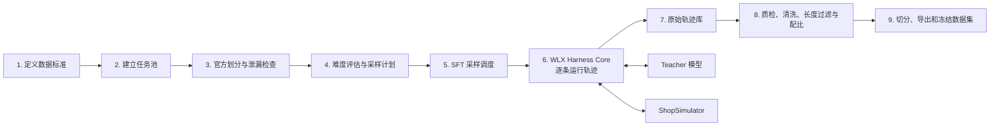
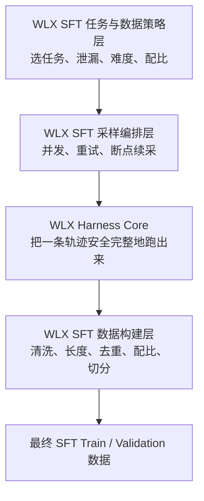

# WLX SFT 数据采集流水线设计

## 1. 设计目标

我们要建设的不是一个单独的“SFT 采样函数”，而是一条完整的 **WLX SFT 数据采集流水线**。

其中，`wlx-harness-core` 只是中间负责“把一条轨迹正确跑出来”的发动机。任务选择、难度配比、数据清洗等工作不应该全部塞进 Core。

本文按照下面的边界理解“不使用原项目 Harness”：

- 不再调用原项目的 `evaluation/rollout.py::collect_for_task`；
- 不再依赖原项目的 `collection/sft.py` 构造 SFT 数据；
- 继续使用 ShopSimulator，因为它是环境，不是 Harness；
- 由 WLX 的 Environment Adapter 连接 ShopSimulator；
- Teacher、任务选择、清洗、配比全部通过 WLX 自己的 SFT 流水线完成。

## 2. 流水线阶段划分



| 阶段 | 主要工作 | 与 Harness Core 的关系 |
|---|---|---|
| 1. 定义数据标准 | 定义什么是好数据、允许哪些终局、Token 上限和目标数量 | 无关，属于 SFT 数据策略 |
| 2. 建立任务池 | 收集候选任务，整理商品类别和约束信息 | 无关 |
| 3. 官方划分与泄漏检查 | 使用官方 Train/Evaluation 划分，检查任务编号不重叠和隐藏信息不外泄 | 不属于 Core |
| 4. 难度和采样计划 | 决定简单、中等、困难任务分别采多少 | 不属于 Core |
| 5. 采样调度 | 负责并发、重试、断点续采和每题采样次数 | 属于 WLX SFT 阶段层 |
| 6. 在线运行轨迹 | 控制模型、工具、环境、上下文、Step 和终止 | 属于 Harness Core |
| 7. 保存原始轨迹 | 保存成功和失败轨迹，以及配置和版本信息 | Core 产生轨迹，SFT 层负责落盘 |
| 8. 清洗和配比 | 成功筛选、长度检查、去重和重新平衡 | 属于 SFT 数据处理层 |
| 9. 切分和冻结 | 生成 Train/Validation、哈希和统计报告 | 属于数据工程层 |

## 3. 任务选择

选择什么任务、每类任务选择多少，属于“任务策划层”，不属于 Harness Core。

需要考虑：

- 商品类别是否平衡；
- 预算、品牌、颜色、尺寸等约束类型是否齐全；
- 是否包含搜索、详情核验、规格选择等不同能力；
- 同一个任务采样几次；
- 哪些任务用于 SFT，哪些保留给 GRPO 和 Evaluation。

Core 不需要知道“为什么选这个任务”。它只接收一个 `EpisodeRequest`，然后安全、完整地把任务跑完。

### 3.1 已确定沿用的任务池原则

第一版沿用原项目的简单做法：候选任务只来自 ShopSimulator 官方 Train 任务池，不另外人为规定商品类别、品牌或需求类型的固定比例。每个 `task_id` 最终最多贡献一条主 SFT 轨迹，优先保证任务覆盖面，而不是让少数容易成功的任务重复占据数据集。

任务难度不照搬原项目的轨迹长度桶，而是按照第 9 节的“规则初分、固定试采、结果校准”方案生成。任务池阶段只准备计算难度所需的隐藏字段，这些字段不能进入 Teacher 可见的 Prompt 或 Observation。

## 4. 任务泄漏控制

泄漏至少要在三个时间点检查。

### 4.1 采样前

提前排除 Evaluation/Test 的任务，防止采出不能用于训练的数据，也减少不必要的模型和环境开销。

### 4.2 采样中

WLX Harness Core 必须保证 Teacher 看不到下面这些环境内部信息：

- `target_asin`；
- 正确答案；
- Reward；
- 环境内部目标；
- 隐藏的 `goal`。

这些信息可以进入内部审计数据，但不能进入模型可见的 Messages 和 Observation。

### 4.3 采样后

当前版本直接使用 ShopSimulator 官方任务表以及官方 Train/Evaluation 划分。论文已经说明任务采用人工一对一标注，并由标注人员检查是否存在其他相似商品也能完全满足需求。因此，第一版默认官方数据划分可信，不再额外引入语义相似度模型、`task_group_id` 或人工语义复核。

当前只执行下面这些简单检查：

- 官方 Train 与 Evaluation 的 `task_id` 不能重复；
- 同一个 `task_id` 采出的多条轨迹必须放在同一个 SFT 子集中，不能分散到 Train 和 Validation；
- `target_asin`、Reward、标准答案和环境内部目标只能用于离线校验，不能进入 Teacher 可见的 Prompt、Messages 或 Observation。

如果以后自行新增、改写或合并任务，再重新讨论语义重复检查和任务分组，不能把当前对官方数据的信任直接套用到自建数据上。

## 5. 在线轨迹采样

在线轨迹采样是 `wlx-harness-core` 的主要职责。Core 应负责：

- 创建并释放独立的 ShopSimulator Session；
- 组织任务、历史消息和工具定义；
- 请求 Teacher 生成下一步操作；
- 检查工具调用是否合法；
- 把工具调用转换成环境动作；
- 执行环境动作并接收 Observation；
- 管理上下文预算和 Observation Projection；
- 控制最大 Step、最大 Assistant 回合和终止条件；
- 校验终局 Reward；
- 记录完整、可审计的原始轨迹；
- 对模型错误、协议错误、基础设施错误和释放错误进行分类。

Core 只需要保证“一条轨迹正确、安全、完整地运行”，不负责决定这条轨迹最终是否应该进入 SFT 训练集。

### 5.1 已确定沿用的采样机制

下面这些基础机制继续沿用：

- Teacher 模型和采样参数通过配置传入，并把模型版本、`temperature`、`top_p`、seed 和 Prompt 版本完整写入批次元数据；
- 每个 Assistant 回合只执行一个工具调用，单轮模型输出上限为 1,536 Token，环境执行 Step 上限为 35；
- 支持设置目标合格轨迹数，达到目标后停止继续派发任务；
- 支持有限并发，每条轨迹独占自己的模型客户端和 ShopSimulator Session，由调度器统一写入结果；
- 模型接口的短暂断线和超时允许有限次数重试；如果环境状态不明确或租约释放失败，则暂停整批采集，不能冒险重复执行购物动作；
- 使用 `(task_id, attempt_index)` 识别已完成尝试并支持断点续采；续采前还必须核对 Teacher、Prompt、工具、任务计划、Held-out 和 Harness 指纹，缺少记录或契约变化时改用新目录。

任务采样分成两种模式：

- **难度校准模式**：分层抽取约 200 个任务，每个任务必须得到 3 次有效尝试。即使第一次成功，也继续完成后两次，用全部约 600 次结果估计 Teacher 的稳定成功概率；
- **正式 SFT 采集模式**：每个任务最多进行 3 次有效尝试。按照 `attempt_index=0,1,2` 顺序执行，出现第一条 `accepted_gold` 后，不再派发这个任务的后续尝试；最终每个任务最多贡献一条主 SFT 轨迹。`valid_alternative_purchase` 会保留并计入难度校准的任务成功率，但仓库契约明确要求训练数据必须是严格 Gold，因此它不会让正式采样提前停止，也不会进入主 SFT。

基础设施故障不消耗“3 次有效尝试”的额度，但受到单独的技术重试上限约束，不能无限重试。正式采集可以并发不同任务，但同一个任务的下一次尝试必须等上一次结果确定后再决定是否派发。

固定运行三次只有在模型端能够产生有意义的采样差异时才有效。校准批次应使用与正式采集目标一致、已经冻结的采样分布，并通过不同 seed 或低但非零的 `temperature` 产生独立样本。如果最终只能使用完全确定性的 `temperature=0` 接口，就不能把同一结果机械重复三遍，而应改为扩大不同任务的试采数量。具体 Teacher 采样参数属于运行前必须冻结的配置。

## 6. 原始轨迹保存

成功和失败轨迹都应该先保存到只读的原始轨迹库中。后面的清洗操作只能生成新的派生文件，不应覆盖原始数据。

原始轨迹至少应记录：

- `trajectory_id`、`task_id`、官方数据划分和 `attempt_index`；
- `outcome_type`、`attempt_valid`、`task_success` 和 `sft_disposition`；
- Teacher 模型、采样参数和 Chat Template 版本；
- Environment、Reward 和 Tool Schema 版本；
- 完整 Messages、Step、Tool Call、Observation 和终局结果；
- Context Compaction 和 Observation Projection 记录；
- 每次模型请求、整条原始轨迹和最终 SFT 序列的 Token 统计；
- 错误、终止原因和环境释放结果；
- 创建时间、采样配置记录和数据哈希。

保存失败轨迹有两个作用：一是便于检查采样系统是否有问题，二是便于以后研究错误恢复、正确放弃等训练数据。

### 6.1 已确定沿用的存储结构

沿用原项目“原始数据和派生数据分开”的结构：

- `raw.jsonl` 是唯一事实源，成功、失败和异常轨迹都先追加保存；
- `accepted.jsonl` 与 `rejected.jsonl` 分别保存接收结果和拒绝原因；
- `sft.jsonl` 是清洗后、切分前的训练格式；
- `train.jsonl` 与 `validation.jsonl` 是最终训练子集；
- `metadata.json` 和统计文件记录配置、行数、拒绝原因与 SHA-256。

所有派生文件都必须能够只依靠 `raw.jsonl` 和固定配置重新生成。API Key 等秘密信息不能写进任何轨迹或元数据。

当前冻结数据统一整理到：

```text
outputs/wlx-data-v1/
├── wlx-raw/
│   ├── wlx-calibration-200/  # 200 个校准任务：canonical 942 行 + 历史补充 49 行
│   ├── wlx-formal/           # 后续六批正式采样：2,389 行
│   └── wlx-records.jsonl     # 全部 3,380 条轨迹的逐条结果记录
└── wlx-sft/
    ├── wlx-sft.jsonl         # 最终 428 条 SFT；train/validation 为 385/43
    └── wlx-records.jsonl     # 3,331 条候选轨迹的接收/拒绝记录
```

`wlx-records.jsonl` 逐条记录成功、失败、技术异常和 SFT 去留；各目录的 `wlx-manifest.json` 保存来源、计数与 SHA-256，采样配置和计划放在 `wlx-provenance/`。

### 6.2 统一的尝试结果模型

一个字段无法同时表达“尝试是否有效”“任务是否成功”和“是否进入 SFT”，因此第一版使用下面四个字段：

| 情况 | `outcome_type` | `attempt_valid` | `task_success` | `sft_disposition` |
|---|---|---:|---:|---|
| 购买目标商品 | `gold_purchase` | `true` | `true` | `accepted_gold` |
| 购买不同但完全合格的商品 | `valid_alternative_purchase` | `true` | `true` | `alternative_audit` |
| 错误购买 | `wrong_purchase` | `true` | `false` | `rejected` |
| 正常达到 Step 上限 | `max_steps` | `true` | `false` | `rejected` |
| 正常结束但没有完成任务 | `no_purchase` | `true` | `false` | `rejected` |
| 模型陷入重复循环 | `repeat_loop` | `true` | `false` | `rejected` |
| 环境、API 或采集器故障 | `infrastructure_error` | `false` | `null` | `retry` |

“有效失败”不是一种模糊的质量评价，而是 `attempt_valid=true` 且 `task_success=false`：环境、模型服务和 Harness 均正常，Teacher 得到了一次公平尝试，但最终没有完成任务。模型自己发出非法动作而被 Guard 拒绝，属于模型行为失败；如果是 Guard 配置错误导致合法动作被误拒，则属于无效尝试。两者必须通过错误来源字段区分。

`valid_alternative_purchase` 在难度校准中按成功计算，但继续单独标记并进入 `alternative_audit`。当前仓库的训练契约要求完整 `gold_purchase`，因此第一版不把替代购买加入主 SFT。

## 7. 轨迹清洗与质量检查

轨迹清洗属于 SFT 数据处理层，不属于 Harness Core。

可以先把轨迹分成三类：

- **无效轨迹**：环境故障、模型接口失败、Reward 格式错误或环境释放失败；
- **低质量轨迹**：死循环、大量无效动作、格式损坏或者没有完成任务；
- **合格轨迹**：合法完成任务，并且终局符合当前数据集定义的训练目标。

不能默认认为“只有成功购买才能成为好数据”。如果希望模型学会下面这些能力，就需要为它们分别定义合格标准和数据配比：

- 找不到合适商品时正确结束；
- 预算或品类不满足时拒绝购买；
- 遇到非法动作后进行正确恢复；
- 商品确实满足要求时完成正确购买。

最终训练数据还需要执行：

- 删除 Teacher 私有推理；
- 删除 Reward、标准答案和环境内部诊断字段；
- 出现 Guard 拒绝或多工具调用截断时，整条轨迹退出主 SFT，不通过删除错误消息来修补轨迹；
- 检查 Tool Call 与环境 Action 是否一致；
- 检查是否存在重复、无意义往返和异常长 Observation；
- 对轨迹和任务进行去重。

### 7.1 第一版轨迹接收规则

- `accepted_gold`：目标 ASIN 购买成功，且过程合法、无泄漏、长度合格；
- `alternative_audit`：虽然不是目标 ASIN，但类别、预算和全部有效偏好均满足；这类数据单独保存，供难度统计和质量研究使用，当前不加入主 SFT；
- `partial_alternative_purchase`、Reward 无效、错误购买和异常轨迹不进入主 SFT，分别放入隔离区或拒绝集；
- Teacher 的私有 `reasoning_content` 保留在受控的原始轨迹中，但从最终 SFT Messages 删除，不计算 Loss；
- 公开的 `assistant.content` 完整保留并参与 Loss，不做逐段语义审核；只机械排除隐藏答案、Reward、接口错误和调试信息，并通过 System Prompt 要求公开内容尽量简短。
- `blocked_tool_calls` 或 `tool_call_truncations` 非空的轨迹不进入主 SFT，但完整保留在原始轨迹库中；

这样既不会把隐藏目标 ASIN 当成唯一正确答案，也能避免未经核验的替代购买和 Teacher 私有推理污染训练数据。

### 7.2 已确定沿用的机械检查

不增加第二个 LLM 来判断轨迹好坏，继续沿用原项目能够由代码确定的检查：

- 轨迹和环境都必须正确到达终局；
- 终局 Reward 版本、有效性、购买状态和终止原因必须互相一致；
- Tool Call 名称、参数、环境 Action 和实际 Step 必须一一对应；
- 商品编号、按钮和规格只能来自最新 Observation 中当前可操作的目标；
- 失败轨迹必须记录明确拒绝原因，不能只丢弃而不留痕；
- 最终训练消息使用字段白名单，删除内部诊断字段，并把终局 Reward 文本替换成普通的完成提示。

死循环首先由环境终止规则和最大步数兜底，清洗阶段只做确定性的重复与异常检查，不引入复杂的语义审核。

## 8. 轨迹长度控制

长度问题需要分成“采样时的运行安全”和“训练数据是否合格”两层。

### 8.1 采样时的运行安全

这一部分由 Harness Core 负责，包括：

- 最大环境 Step；
- 最大 Assistant 回合；
- 模型上下文预算；
- 单轮输出预算；
- Observation Projection；
- 上下文超限后的终止或压缩策略。

第一版采用 24,576 Token 总窗口，单轮生成预留 1,536 Token，另留 512 Token 安全余量，因此每次模型请求的历史输入最多为 22,528 Token。

正式采样默认开启总窗口检查和 Observation Projection。Projection 必须按页面结构保留商品编号、价格、规格和可点击按钮，只压缩低优先级长文本，不能直接从字符串中间粗暴截断；未经压缩的原始 Observation 继续保存在 `raw.jsonl` 中。

### 8.2 训练数据长度检查

这一部分由 SFT 数据处理层负责。必须使用最终训练模型相同的 tokenizer 和 Chat Template，计算完整训练序列的实际 Token 数。

处理原则是：

- 不能按字符数判断长度；
- 不能只统计 Assistant 输出；
- Tool Schema、System、User、Assistant 和 Tool Observation 都占上下文；
- 超过 24,576 Token 的轨迹应排除、重新采样或在采样阶段降低 Observation 体积；
- 不应在构建训练集时从中间粗暴截断工具调用或终局购买步骤。

Token 统计从约 600 次难度校准采样开始启用，并一直贯穿正式采集、清洗和最终数据构建。不能只保留一个含义不清的 `token_count`，而应分三层记录。

每次模型请求记录：

- `input_tokens`；
- `output_tokens`；
- `request_total_tokens`；
- Token 来源是模型 API 的 Usage，还是本地 Tokenizer 重算结果。

整条原始轨迹汇总记录：

- `prompt_tokens_sum`：各轮重复发送上下文后的累计输入量，主要用于 API 成本统计，不等于最终训练序列长度；
- `completion_tokens_sum`；
- `max_request_tokens`：单次模型请求实际达到的最大上下文长度；
- `raw_trajectory_tokens`；
- `tokens_before_projection` 和 `tokens_after_projection`；
- `num_env_steps`、`num_assistant_turns` 和 `num_messages`。

构建最终训练行后，必须使用实际训练模型的 Tokenizer 和 Chat Template 重新记录：

- `sft_total_tokens`：System、User、Assistant、Tool Schema 和 Tool Observation 组成的完整训练序列长度，是否满足 24,576 Token 上限以它为准；
- `sft_loss_tokens`：真正参与 Loss 的 Assistant 内容和 Tool Call Token 数；
- `tokenizer_name`、`tokenizer_revision` 和 `chat_template_version` 或指纹。

Teacher API 返回的 Usage 主要用于运行成本和单轮安全监控，不能代替最终的 `sft_total_tokens`。Teacher 与训练模型使用不同 Tokenizer 时，两者的 Token 数可能不同。这套记录可以补上当前原项目 SFT 数据没有逐条保存长度信息的问题。

## 9. 任务难度与轨迹质量

需要把两个概念分开：

- `task_difficulty`：任务本身在当前 Teacher 和 Harness 配置下有多难；
- `trajectory_quality`：Teacher 这一次完成得好不好。

不能简单认为“轨迹越长，任务越难”。Teacher 乱逛也可能让一个简单任务产生很长的轨迹。

第一版采用“规则初分、固定试采、结果校准”的两阶段方案。规则部分完全由代码确定，不使用另一个 LLM 给任务打分。

### 9.1 采样前的三个规则指标

**约束负担 `C`**

先对任务要求去重，得到独立约束数 `A`：每个核心功能或属性、每个必须选择的规格轴、明确品牌、明确型号和明确预算分别算一个要求。所有任务都有的商品类别不参与区分。

```text
C = min(1, log(1 + A) / log(1 + A95))
```

`A95` 是官方 Train 任务中约束数量的 95 分位：把任务按约束数从小到大排列，约 95% 的任务不超过这个值，只有最复杂的约 5% 超过它。使用 95 分位是为了防止极少数异常任务拉坏整个分数范围。该值只从 Train 任务计算并随数据版本冻结。

**检索阻力 `R`**

固定商品库、搜索索引和查询方法，离线使用完整 instruction 搜索，记录前 20 个结果中第一个能够被当前 Reward 接受的商品排名。若前 20 个都没有合格商品，按第 21 名处理。

```text
R = log(1 + min(rank - 1, 20)) / log(21)
```

这个指标表示“固定基准查询下有多难搜到合格商品”，不是模型所有可能搜索策略的绝对难度。商品库、搜索索引、Reward 或查询方法改变后必须重算。

**相似干扰商品 `N`**

统计前 20 个结果中被 Reward 拒绝、但已经满足至少约 70% 独立要求的商品数量。这些商品看起来很接近，却仍缺少一个或多个必要条件。

```text
N = min(1, log(1 + near_miss_count) / log(1 + N95))
```

`N95` 是 Train 任务中 `near_miss_count` 的 95 分位。近似匹配和“完全合格”的判断都使用冻结的机械 Reward 规则，不引入语义打分 LLM。

三个指标生成只用于首次试采分层的临时分数：

```text
P = 0.45 × C + 0.35 × R + 0.20 × N
```

可以暂时把 `P` 最低约 30%、中间约 50% 和最高约 20% 分别称为临时简单、中等和困难。这只用于让校准样本覆盖不同结构，不是最终难度标签，也不能用它强行制造最终比例。

### 9.2 约 600 次难度校准采样

从不同临时难度和商品类别中分层抽取约 200 个任务，每个任务固定取得 3 次有效尝试，共约 600 次结果。第一次成功后也必须继续完成其余尝试，否则测到的是“最多三次能否成功一次”，而不是单次尝试的稳定成功概率。

校准阶段规定：

- `gold_purchase` 和 `valid_alternative_purchase` 都记为任务成功；
- 有效失败记为失败；
- 基础设施错误不记成功也不记失败，需要技术重试或标记该任务有效尝试不足；
- 三次结果不是单独给每道题下最终结论，而是与全部任务结果共同用于学习规律。

使用一个小型逻辑回归，根据属性数、规格轴数、品牌、型号、预算、`R` 和 `N` 预测指定 Teacher 在指定 Harness 配置下的成功概率。它是只有少量数字输入和权重的统计模型，不是另一个语言模型，也不参与购物决策。

训练与验证必须按 `task_id` 隔离，同一任务的三次尝试不能同时出现在逻辑回归的训练侧和验证侧。第一版约 600 次结果基本够用；如果成功或失败任一侧少于约 100 次，或者三档实际成功率没有依次下降，应优先增加不同任务，而不是继续反复运行同一个任务。

最终定义：

```text
task_difficulty_score = 1 - predicted_success
```

初始分档为：

- `easy`：`predicted_success >= 0.75`；
- `medium`：`0.35 <= predicted_success < 0.75`；
- `hard`：`predicted_success < 0.35`。

这个难度表示“当前 Teacher、Prompt、工具、Reward 和 Harness 配置下的经验难度”，不是永远不变的绝对属性。相关配置改变后必须产生新的 `difficulty_version` 并重新校准。

### 9.3 采样后的轨迹成本

正式采样后另外记录 `productive_steps`，只统计合法并且改变页面状态或带来新证据的环境动作，例如新搜索、打开新商品、查看新的信息页、改变规格选择、翻到新结果页和终局动作。`think`、格式错误、Guard 拒绝和没有获得新信息的完全重复动作不计入 `productive_steps`，但仍保留在原始总 Step 中。

“唯一搜索词数量”通过确定性的搜索词规范化后去重：统一大小写、全半角、标点和多余空格；相同规范化查询重复十次仍只算一个，不使用 LLM 判断两个不同查询是否语义相同。

成功轨迹的长度桶继续采用：

- `short`：3～10 个 `productive_steps`；
- `medium`：11～20 个 `productive_steps`；
- `long`：21～35 个 `productive_steps`。

少于 3 步的成功购物轨迹进入异常复核。Token 数、实际 Step、唯一搜索词和打开的不同商品数量用于表示轨迹成本与质量，不能单独覆盖 `task_difficulty`。

## 10. 难度配比与补采

难度配比需要控制两次。

### 10.1 采样前配比

先用 `P` 分层抽取约 200 个校准任务并固定采满 3 次有效尝试。逻辑回归校准完成后，再按照正式的 `easy / medium / hard` 标签制定任务派发量，避免在不知道真实成功率时提前固定比例。

正式采集时，每个任务最多 3 次有效尝试，第一次获得 `accepted_gold` 后停止。替代购买单独记录但继续尝试剩余额度，争取得到严格 Gold。难度较高的任务可以通过派发更多不同 `task_id` 或使用未成功任务的剩余尝试进行补采，但不能让同一个容易任务贡献多条主 SFT 数据。

### 10.2 清洗后配比

重新检查最终合格轨迹的难度分布。困难任务成功率通常更低，所以即使不同难度采样数量相同，最终数据也会偏向简单任务。

比较合理的执行顺序是：

```text
小规模试采
→ 统计各难度的成功率和平均长度
→ 反推正式采样量
→ 完成正式采样
→ 清洗并检查最终配比
→ 对缺少的类别定向补采
```

第一版把“简单 30%、中等 50%、困难 20%”保留为正式 SFT 合格任务的初始目标，而不是采样前硬编码的事实。约 600 次校准结果出来后，根据三档任务数量、成功率、平均 Token 和合格轨迹保留率确定实际派发量；如果任务池本身不存在足够多的某一档，不能通过修改标签强行凑比例。

同一个任务不能因为容易成功而贡献大量重复轨迹。配比和统计应以 `task_id` 为基础，而不能只看轨迹数量。

最终选数时同时检查两个维度：

```text
task_difficulty × trajectory_length_bucket
```

例如 `hard + short` 可能是困难任务的高效示范，而 `easy + long` 可能是 Teacher 绕路，需要重点清洗。`valid_alternative_purchase` 只进入审计统计，不设置主 SFT 加入比例。

## 11. 数据切分、导出与冻结

最终切分必须按 `task_id` 进行，不能随机打散单条轨迹后再切分。

Train/Validation 默认取约 10% 作为 Validation，并按最终 `task_difficulty` 分层；在每个难度档内部使用“固定随机种子 + `task_id`”计算稳定哈希。同一个任务的所有轨迹始终进入同一侧，相同输入、难度版本和种子能够得到相同结果。商品类别第一版只做分布报告，不强制参与切分；如果某个难度档任务太少，则发出统计警告而不复制任务。

最终训练行继续使用标准 OpenAI Tool Calling JSONL，核心字段为 `trajectory_id`、`task_id`、`messages` 和 `tools`，并附带不进入模型上下文的难度、终局、质量和 Token 元数据。训练时只对 Assistant Token 计算 Loss，System、User 和 Tool Observation 只作为上下文。

需要输出：

- 原始轨迹清单；
- 接受和拒绝轨迹清单；
- 每条拒绝原因；
- 训练集和验证集；
- 任务类型、难度、长度和工具使用分布；
- 各难度采样数、成功率和最终保留率；
- Teacher、环境、Reward、工具、tokenizer 和 Chat Template 版本；
- 每个文件的行数和 SHA-256；
- 流水线配置和可复现随机种子。

数据集一旦冻结，不应直接覆盖。新的任务、过滤规则或难度配比应该产生新的版本目录。第一版不强制商品类别和需求类型配比，但必须在统计报告中展示它们，发现明显偏斜时再决定是否补采。

## 12. WLX 的责任分层



各层职责可以概括为：

- `wlx-harness-core`：保证一条轨迹运行正确、安全、可审计；
- WLX SFT 任务与采样层：决定拿哪些任务调用 Core，以及每个任务采几次；
- WLX SFT 数据构建层：决定哪些轨迹进入训练，以及最终的数据比例和切分方式。

## 13. 第一版实现位置

第一版已经新增独立的 WLX SFT 路径，不调用原项目的 `collect_for_task` 或 `collection/sft.py`：

| 文件 | 作用 |
|---|---|
| `wlx_sft_contracts.py` | 任务、尝试结果、采样配置等公共数据格式 |
| `wlx_sft_outcomes.py` | 区分有效尝试、任务成功与是否进入 SFT |
| `wlx_sft_sampler.py` | 校准/正式调度、并发、技术重试和断点续采 |
| `wlx_sft_storage.py` | 追加保存 `raw.jsonl`、泄漏检查和文件哈希 |
| `wlx_sft_metrics.py` | Token、有效步骤、唯一搜索词和长度桶 |
| `wlx_sft_difficulty.py` | C/R/N 规则分数和纯 Python 逻辑回归校准 |
| `wlx_sft_shopsim_difficulty.py` | 复用 ShopSimulator BM25 与 Reward-v3 预计算 R/N |
| `wlx_sft_dataset.py` | 严格 Gold 清洗、配比、分层切分、导出与冻结 |
| `wlx_sft_deepseek_v4.py` | 按 DeepSeek V4 官方 Encoding 渲染工具调用和 Thinking 上下文 |
| `wlx_sft_tokenizer.py` | 用轻量 Teacher tokenizer 计数，并用训练 tokenizer 做最终精确计数 |
| `wlx_sft_policy.py` | WLX 自己的 OpenAI-compatible Teacher 接口 |
| `wlx_sft_pipeline.py` | 把上面模块串起来的 SFT 阶段总入口 |

现有旧文件未在本次整理中删除，但 WLX SFT 的唯一正式入口是 `WlxSftDataPipeline`；本次没有新增兼容启动器，也不会落回原项目 Harness。

### 13.1 本次实现与修复

- 修复无规格商品打开详情页时 `selected_option` 未定义的问题。
- 修复 SFT 首轮缺少页面状态的问题；现在只接受并传入 Observation v2。
- 修复正常停止、循环结束和步数耗尽被误判为技术故障的问题。
- 修复含 Guard 拒绝、并行调用截断或上下文压缩的“脏 Gold”误入 SFT，并让续采提前停止的问题。
- 修复 DeepSeek `finish_reason=length` 仍被当成完整回复的问题；输出预算同步调整为 1,536 Token。
- 修复单条 Chat Template 异常导致整批构建退出，以及旧 Token 统计覆盖现场重算指标的问题。
- 修复续采和难度拟合缺少配置指纹、三次有效尝试与来源哈希校验的问题。
- 修复 Qwen3.5 文本筛选不必要依赖 `torch/torchvision`，以及任务规划无法读取字典形态规格的问题。

相关离线回归已通过：WLX 105 项，ShopSimulator 商品页 2 项。

## 14. 第一版冻结状态

第一版采样与数据构建已经完成：200 个校准任务得到 600 次有效尝试，完整原始历史共 3,380 条轨迹；最终严格 Gold SFT 为 428 条，按 385/43 切分 Train/Validation，与 Evaluation 的 `task_id` 重叠为 0。

本次冻结配置为：

- Teacher：`deepseek-v4-flash`，Thinking 开启；私有 `reasoning_content` 只留在 Raw，最终 SFT 删除；
- 环境与协议：ShopSimulator Environment v2.1、Reward v3、Observation v2、Tool Schema v2；
- 训练长度：使用固定 revision 的 `Qwen/Qwen3.5-2B` Tokenizer 和官方 Chat Template，完整序列上限 24,576 Token；
- 数据入口：`outputs/wlx-data-v1/`，其中 Raw、SFT、逐条判定记录和 provenance 均已保存并核对 SHA-256。

当前只完成数据阶段，没有启动 SFT、GRPO、模型合并或正式 Evaluation。同步 GitHub 时，代码和文档进入普通 Git；`outputs/` 继续忽略，冻结数据压缩为 Raw/SFT 两个 GitHub Release 附件并附 SHA-256。
